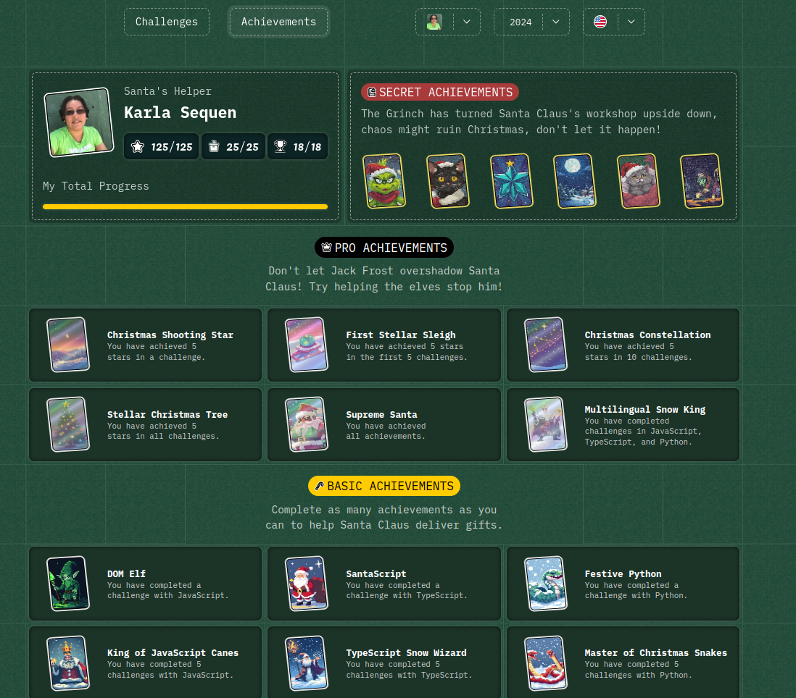

# 2024

## [Day 1: First gift repeated!](./day1)

## [Day 2: Framing names](./day2)

## [Day 3: Organizing the inventory](./day3)

## [Day 4: Decorating the Crhistmas tree](./day4)

## [Day 5: Show pairing](./day5)

## [Day 6: Is the gift inside the box?](./day6)

## [Day 7: The Grinch's attack](./day7)

## [Day 8: The reno race](./day8)

## [Day 9: The magic train](./day9)

## [Day 10: The elfish assembler](./day10)

## [Day 11: Filenames encoded](./day11)

## [Day 12: How much does the tree cost?](./day12)

## [Day 13: Is the robot back?](./day13)

## [Day 14: Weaving the reno](./day14)

## [Day 15: Drawing tables](./day15)

## [Day 16: cleaning the snow path](./day16)

## [Day 17: Grinch's bombs](./day17)

## [Day 18: Santa's Magic Agenda](./day18)

## [Day 19: Stack magical boxes to deliver gifts](./day19)

## [Day 20: Find missing and duplicate gifts](./day20)

## [Day 21: Calculate the height of the Christmas tree](./day21)

## [Day 22: Generate gift combinations](./day22)

## [Day 23: Find the missing numbers](./day23)

## [Day 24: Check if trees are magical mirrors](./day24)

## [Day 25: Execute the magical language](./day25)

## [Day 26: Calculate the completed percentage](./day26)
